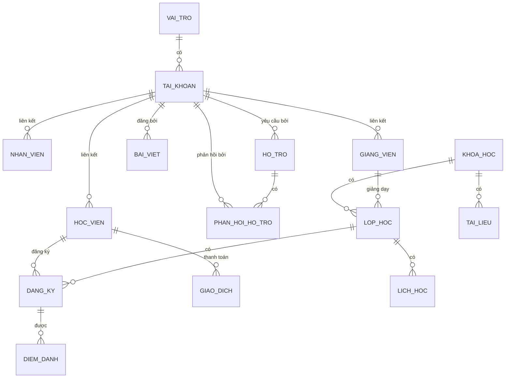

# Tổng quan Cơ sở dữ liệu - Hệ thống Quản lý Trung tâm

## 📊 Database: `learning_center_db` (Phiên bản Tiếng Việt)

### Cấu trúc mới đã hoàn thành! ✅

**15 Bảng (IN HOA) đã được tạo:**
- `VAI_TRO`: Quản lý vai trò (Admin, Nhân viên, Giảng viên, Học viên)
- `TAI_KHOAN`: Quản lý đăng nhập và quyền truy cập
- `HOC_VIEN`: Thông tin chi tiết học viên
- `NHAN_VIEN`: Thông tin nhân sự hành chính
- `GIANG_VIEN`: Thông tin đội ngũ giảng dạy
- `KHOA_HOC`: Danh mục chương trình đào tạo
- `LOP_HOC`: Danh sách các lớp đang và sắp mở
- `LICH_HOC`: Chi tiết buổi học trong tuần
- `DANG_KY`: Quản lý học viên đăng ký lớp và tiến độ
- `DIEM_DANH`: Theo dõi chuyên cần hàng ngày
- `GIAO_DICH`: Quản lý học phí và các khoản thu chi
- `BAI_VIET`: Hệ thống tin tức, thông báo
- `TAI_LIEU`: Kho lưu trữ tài liệu học tập
- `HO_TRO`: Quản lý yêu cầu trợ giúp (Ticket)
- `PHAN_HOI_HO_TRO`: Trao đổi trong hệ thống hỗ trợ

---

## 🔗 Sơ đồ Quan hệ (ER Diagram)

---

## 📋 Mô tả chi tiết các bảng chính

### 1. Quản lý Tài khoản & Phân quyền

- **VAI_TRO**: Lưu trữ các nhóm quyền (Admin, Nhân viên...).
- **TAI_KHOAN**: Chứa thông tin đăng nhập. `ID_VaiTro` xác định quyền của người dùng.

### 2. Quản lý Thực thể

- **HOC_VIEN**: Mã học viên (unique), trình độ, ngày nhập học, trạng thái.
- **NHAN_VIEN**: Mã nhân viên, chức vụ, lương, phòng ban.
- **GIANG_VIEN**: Chuyên môn, học vị, mức lương giờ.

### 3. Đào tạo & Lớp học

- **KHOA_HOC**: Thông tin chung về chương trình, học phí.
- **LOP_HOC**: Gắn với một khóa học và một giảng viên.
- **LICH_HOC**: Xác định thứ, giờ bắt đầu, giờ kết thúc và phòng học.

### 4. Tài chính & Chuyên cần

- **GIAO_DICH**: Lưu vết học phí, nội dung thanh toán.
- **DIEM_DANH**: Trạng thái (Có mặt, Vắng, Muộn) gắn với từng học viên trong lớp.

---

## 🎯 Dữ liệu mẫu đã sẵn sàng

- **Admin**: `admin` / `123456`
- **Nhân viên**: `nhanvien01` / `123456`
- **Giảng viên**: `giangvien01` / `123456`
- **Học viên**: `hocvien01` / `123456`
